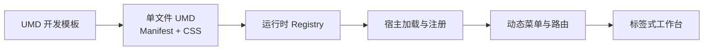

# GavinYin Hub

[](https://github.com/gy-926/Dashboard-lightWeight/actions/workflows/ci.yml)

一个使用 Vue 3、Nest API、MySQL 和本地文件存储的企业工作台，用统一的路由、标签、鉴权和运行时生命周期承载本地页面、远程 Vue SFC、UMD 业务组件与 iframe 系统。`Dashboard-lightWeight-Api` 分支使用完整的自建后端，不依赖外部数据库、认证或对象存储服务。

本项目不是通用 Vue Admin 皮肤，也不是带 JavaScript 沙箱的通用微前端框架。它面向来源可信、技术栈可控的企业业务模块，强调低成本接入、单文件交付和渐进式集成。

## 在线体验

- 地址：[https://www.gavinyin.online/entry/umdDashboard](https://www.gavinyin.online/entry/umdDashboard)
- 演示账号：`admin@example.com`
- 演示密码：`admin@123456`

该账号仅用于功能演示，请勿填写真实或敏感信息。公开部署 Demo 时，应使用独立数据环境、限制高风险管理操作，并按需定期重置数据。

## 解决的问题

传统后台模板通常只负责本地页面。本项目进一步处理企业系统中常见的运行时接入问题：

- 后端菜单在登录后生成路由、标签和权限导航；
- 多个独立业务仓库以单文件 UMD 形式交付；
- 宿主统一提供 Vue、ECharts、Bridge、主题和基础布局；
- 远程组件异步注册后自动进入菜单和路由；
- 页面关闭、退出登录或权限变化时清理用户级运行状态；
- 通过兼容层继续承载远程 Vue SFC、iframe 和历史 UMD 协议。

## 核心能力

- **异构页面运行时**：本地 Vue、远程 Vue SFC、UMD/ESM 组件和 iframe 使用同一工作台导航。
- **UMD Registry**：支持按脚本 URL、文件名、显式全局变量和历史默认名称解析 UMD 导出。
- **Manifest 驱动菜单**：根据组件清单、中文名、图标和描述生成 UMD 菜单与路由。
- **多标签工作台**：统一处理打开、切换、刷新、关闭和批量关闭。
- **缓存与竞争保护**：远程 Vue 加载去重，并阻止已失效异步任务重新写入缓存。
- **会话隔离**：退出和重新认证后清理旧用户的标签、动态路由与页面运行时。
- **自建鉴权与接口**：通过 Nest API 和 MySQL 管理注册、登录、令牌续期、菜单、组织部门、角色与用户权限。
- **本地文件与 UMD 版本**：文件写入服务端持久目录，元数据和 UMD 版本关系保存在 MySQL。
- **主题与响应式布局**：支持侧边、顶部和混合导航，以及亮色、暗色和窄屏布局。

## 主项目与 UMD 模板

完整体系由两个仓库组成：

| 仓库 | 职责 |
| --- | --- |
| [Dashboard-lightWeight](https://github.com/gy-926/Dashboard-lightWeight) | 宿主工作台、鉴权、动态路由、菜单、标签和远程组件运行时 |
| [Dashboard-lightWeight-UMDTemplate](https://github.com/gy-926/Dashboard-lightWeight-UMDTemplate) | 单文件 UMD 业务组件的开发、样式隔离、Manifest 和产物验证 |



UMD 模板将 Vue、ECharts 和 `@kivii.com/bridge` 设为外部依赖，避免业务组件携带第二份运行时。宿主从本地 npm 依赖提供 ECharts，并通过 `app.use()` 或具名导出完成注册；页面不再加载远程 ECharts 和 MD5 脚本。

## PageHost 页面保活

后端菜单生成的 KVID 动态页默认由应用根级 PageHost 承载，支持 iframe、远程 Vue SFC 和 Hosted UMD。标签切换只隐藏页面并保留真实实例；关闭、刷新和会话重建进入明确的销毁链路，填写中的表单不会因普通标签切换被清空。

PageHost 不需要在构建时预知 KVID。可通过 `PageHostEnabled: false` 全局回退，或使用 `PageHostExcludedKvids` 精确排除个别页面。详细行为、诊断命令和新旧方案对比见 [PageHost 页面保活](docs/page-host.md)。阶段 6 的驻留上限和 LRU 当前暂缓。

## 技术栈

- Vue 3、TypeScript、Vite
- Vue Router、Pinia、VueUse
- Tailwind CSS、Font Awesome
- Nest API、MySQL
- Vitest
- `vue3-sfc-loader`
- `@kivii.com/bridge`

## 快速开始

### 本地启动

仓库已经包含 `server/` Nest API。首次使用时准备后端配置：

```bash
cp server/.env.example server/.env
```

在 `server/.env` 中填写本机 MySQL 用户和密码，并确保 MySQL 已启动。之后可以一键启动：

```bash
pnpm dev
```

该命令会自动安装缺失的后端依赖、执行数据库迁移、创建本地演示管理员、先启动 API，确认 API 可访问后再启动前端。

也可以在两个终端分别启动：

```bash
# 终端 1：迁移数据库并启动 API
pnpm dev:api

# 终端 2：只启动前端
pnpm dev:web
```

默认本地管理员为 `admin@example.com` / `admin@123456`。如果同邮箱用户已经存在，只会授予超级管理员角色，不会重置原密码。可在 `server/.env` 中修改 `DEMO_ADMIN_EMAIL` 和 `DEMO_ADMIN_PASSWORD`。

### 环境要求

- Node.js 24（同时开发前端和内置 API）；只开发前端时最低为 20.19
- pnpm 10（前端）和 npm（内置 API）
- MySQL 8 或兼容版本

### 安装与启动

```bash
git clone https://github.com/gy-926/Dashboard-lightWeight.git
cd Dashboard-lightWeight
corepack enable
pnpm install
cp .env.example .env
pnpm dev
```

在 `.env` 中填写 Nest API 地址：

```dotenv
VITE_API_BASE_URL=/api
```

前端开发服务器默认监听 `127.0.0.1:5173`，并将 `/api` 代理到内置 Nest API 的 `127.0.0.1:3000`。源码开发时先进入 `server/` 配置 MySQL、执行迁移并启动 API。生产环境也需要把同源 `/api` 转发到 Nest，并将响应 cookie 的 `/auth` 路径改写为 `/api/auth`。

### 常用命令

| 命令 | 说明 |
| --- | --- |
| `pnpm dev` | 迁移数据库，依次启动 API 和前端 |
| `pnpm dev:api` | 迁移数据库并启动内置 Nest API |
| `pnpm dev:web` | 只启动前端开发服务器 |
| `pnpm test` | 运行 Vitest 回归测试 |
| `pnpm test:e2e` | 运行 PageHost Playwright 浏览器测试 |
| `pnpm test:watch` | 监听模式运行测试 |
| `pnpm type-check` | 执行 Vue/TypeScript 类型检查 |
| `pnpm build` | 类型检查并生成生产构建 |
| `pnpm preview` | 预览生产构建 |

## 自建 API 初始化

进入仓库内置的 `server/`，配置 MySQL 和本地文件目录，然后执行迁移并启动服务：

```bash
cd server
cp .env.example .env
npm install
npm run migration:run
npm run start:dev
```

迁移创建用户、会话、文件、Dashboard 功能、菜单、组织部门、角色、权限绑定和 UMD 版本表。管理接口要求 `users.role=super_admin`。浏览器统一通过 `VITE_API_BASE_URL` 指向的 Nest API 调用认证和业务接口；默认值为 `/api`。

“系统功能”导航仅对超级管理员显示，普通用户无法进入其中的页面。其下的“功能列表”“用户列表”“组织机构”是三个独立模块，分别位于 `/system/feature-list`、`/system/user-list` 和 `/system/organization`。管理员在功能行开启普通用户访问并选择授权部门，在用户行选择“普通用户”或“管理员”并分配所属部门。普通用户访问功能时需同时获得功能和部门授权；下级部门继承启用的上级部门授权，超级管理员拥有全部功能权限。新增迁移会清空旧的普通用户功能授权，需由管理员逐项开启；旧自定义角色授权不再参与访问判断。权限菜单在登录和路由重新生成时从服务端获取。

应用启动时不会请求 `/codes` 配置。随应用发布的示例从 `/umd-showcase` 读取；功能中心导入的 UMD 文件由 Nest 保存到 `FILE_STORAGE_ROOT`，并通过不可变的 `/dashboard-assets/:versionId/:fileName` 地址按需加载。

接口、认证续期、权限和生产代理配置见 [自建 API 接入](docs/self-hosted-api.md)。

## UMD 接入契约

“UMD Runtime Lab” 支持选择 UMD `.js` 文件并读取其 manifest。确认模块标识和版本后，前端通过 `POST /dashboard-functions/import-umd` 将原始 JS 保存到 Nest 本地文件存储，并把组件清单同步到功能列表。页面会保留历史版本；启用历史版本时会更新功能来源地址、清理动态路由缓存并重新加载对应脚本。

推荐使用配套模板构建业务 UMD。每个 UMD 至少应提供：

```ts
export const manifest = {
  libName: 'exampleLibrary',
  format: 'umd',
  fileName: 'example-library.umd.js',
  version: '1.0.0',
  components: ['ExamplePanel'],
  componentsDetailed: [
    {
      name: 'ExamplePanel',
      zhName: '示例面板',
      icon: 'fas fa-cube',
      description: '用于演示宿主运行时接入。',
    },
  ],
}
```

新模板产物会自动写入：

```ts
window.__KIVII_UMD_REGISTRY__.byUrl[scriptUrl]
window.__KIVII_UMD_REGISTRY__.byFileName[fileName]
```

旧系统仍可继续提供 `GlobalName`。宿主会按兼容顺序解析，不要求一次性迁移全部历史组件。

## 目录结构

```text
server/                            内置 Nest API、TypeORM 迁移与接口测试
src/
├── api/                         Nest API 客户端
├── bridge/                      Bridge 与宿主 OpenTab 适配
├── components/                  通用组件与重新登录弹窗
├── layouts/                     工作台布局、菜单、标签和主题
├── router/                      静态路由、动态路由与导航守卫
├── store/                       页面运行时与菜单配置状态
├── utils/remoteComponentLoader  UMD/ESM 加载、Registry 与注册
└── views/_builtin/iframe-page   iframe、远程 Vue 和 UMD 页面入口

public/umd-showcase/             随前端发布的 UMD 示例
public/umd/                      随应用发布的 UMD 兼容性制品
tests/                           Vitest 回归测试
docs/                            模块说明与实现记录
```

## 安全边界

远程 UMD、ESM 和 Vue SFC 与宿主共享页面权限，可以访问当前页面允许访问的 DOM、网络和全局对象。因此：

- 只加载受信任、经过审核的组件来源；
- 不要把本项目描述为第三方代码沙箱；
- 不可信页面应使用独立域名和受限 iframe；
- 生产环境应使用明确的资源白名单、HTTPS 和合适的 CSP；
- 演示账号必须与真实业务数据隔离，并限制高风险管理操作。

## 当前工程状态

项目已在服务器环境持续试运行并保持迭代。当前自动化基线覆盖页面身份传递、远程 Vue 缓存失效、异步加载代次和用户运行时清理。

仍在推进的方向包括：

- 扩充浏览器端到端测试；
- 为 Manifest 和远程协议建立共享类型；
- 拆分超大页面和加载器的职责；
- 扩充 Lint、运行时诊断和兼容矩阵；
- 逐步明确库缓存、页面实例和业务数据缓存的边界。

## 文档

- [自建 API 接入](docs/self-hosted-api.md)
- [远程组件加载](docs/remote-component-loading.md)
- [动态路由模块](docs/dynamic-routes-module.md)
- [iframe 与动态页面](docs/iframe-page-module.md)
- [Bridge OpenTab](docs/kivii-bridge-opentab.md)
- [实现分析](docs/implementation_analysis.md)

## 贡献

欢迎通过 Issue 提交问题、复现步骤和改进建议。提交代码前请至少运行：

```bash
pnpm test
pnpm type-check
pnpm build-only
```

修改 UMD 协议时，请同时验证旧 `GlobalName` 和新 Registry 两种加载方式。

## License

[MIT](LICENSE) © 2025 gy-926
