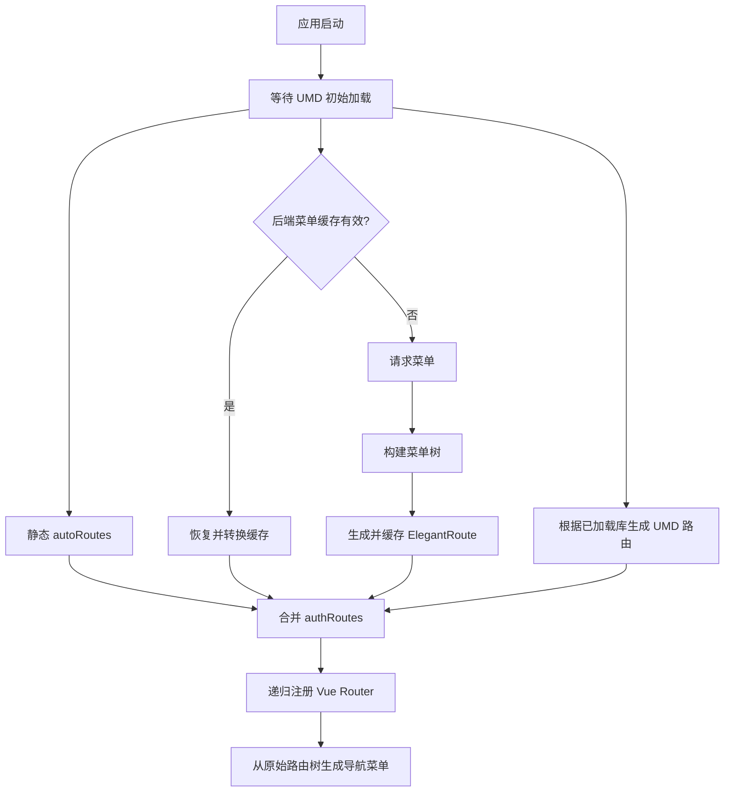

# 动态菜单与路由说明

本文档对应 `githubDashboard` 分支当前实现，说明静态路由、后端菜单路由和 UMD 自动发现路由如何合并并注册到 Vue Router。

## 组成结构



路由来源包括：

- [auto/routes.ts](../src/router/auto/routes.ts)：首页、UMD 管理、示例、菜单配置和系统功能等固定页面。
- [routes/index.ts](../src/router/routes/index.ts)：后端菜单获取、树构建、缓存、转换与合并。
- [umd/routes.ts](../src/utils/umd/routes.ts)：根据成功加载且允许展示的 UMD 库生成路由。
- [router/index.ts](../src/router/index.ts)：初始化路由、递归注册、菜单同步和登录后重载。

## 全局配置

动态菜单使用 `window.uiGlobalConfig` 初始化运行参数。主要字段包括：

- `InternalCode`：菜单工作空间标识。优先从 `/entry/{InternalCode}` 路径读取，其次使用全局配置，默认 `umdDashboard`。
- `UserCode`：参与缓存隔离，默认 `admin`。
- `Origin` / `UseWindowOrigin`：后端来源配置。
- `DisplayName`、`Icon`、`Scope`、`Parameters`：工作空间展示与扩展参数。
- `IsAuthenticated`、`PublicLoginUrl`：认证状态与外部登录地址。

`setGlobalConfig()` 可在运行时合并配置，`syncInternalCodeToEntryPath()` 可把当前 InternalCode 同步到浏览器入口路径。

## 后端菜单获取

[menu-service.ts](../src/router/routes/menu-service.ts) 通过 [dashboard-admin.ts](../src/api/dashboard-admin.ts) 获取运行时菜单。响应至少包含：

```ts
{
  MenuRoot: { Kvid, Title }
  MenusMain: { Results: MenuItem[] }
}
```

`getRootMenu()` 保存 `MenuRoot.Kvid`，并过滤 `Type === 'System'` 的菜单记录。请求失败时服务层记录警告并返回空菜单结构，使应用可以继续运行固定路由和 UMD 路由。

菜单项常用字段：

| 字段 | 用途 |
| --- | --- |
| `Kvid` | 路由身份和默认路径片段 |
| `ParentKvid` | 构建父子关系 |
| `Title` / `DisplayName` | 菜单标题，优先使用 DisplayName |
| `Icon` / `Order` | 导航图标和顺序 |
| `FunctionKvid` | 功能身份及渲染类型辅助判断 |
| `Handler` | 页面 URL、远程 Vue 地址或 UMD 标签 |

## 菜单树构建

`getMenuTree()` 将扁平数组转换为树：

1. `ParentKvid` 为空的节点作为根节点。
2. 父节点不在本次数据集中的孤儿节点也降级为根节点。
3. 根据 `ParentKvid === parent.Kvid` 递归填充 `Children`。

该函数会直接写入菜单项的 `Children` 字段。`analyzeTree()` 可统计深度、节点、叶子、容器和功能节点数量，但不参与正式路由生成。

## 后端菜单路由生成

路由先生成项目内部的 `ElegantRoute`，再映射为 `RouteRecordRaw`。

### 根节点

- `name`：默认使用 `Kvid`。
- `path`：默认使用 `/{Kvid}`。
- `component`：`layout.base`。
- `meta`：包含标题、图标、顺序和 `keepAlive`。

### 容器节点

有子节点的菜单使用 `layout.passthrough`，随后递归生成 children。若容器自身还有 `FunctionKvid`，会在 children 首位加入 `path: ''` 的默认页面，并交给 `view.iframe-page` 渲染。

### 页面节点

叶子节点统一使用 `view.iframe-page`，路由 props 包含：

```ts
{
  url,
  kvid,
  functionKvid,
  handler,
  type
}
```

`FunctionKvid` 以 `.vue` 结尾时初始类型为 `vue`，否则为 `webview`。IframePage 随后会以 Handler 为准再次判断 WebView、Vue SFC 或 UMD；详细规则参见 [动态页面容器说明](./iframe-page-module.md)。

## 组件映射与转换

当前组件映射直接定义在 [routes/index.ts](../src/router/routes/index.ts)，不再依赖旧版 `router/elegant/imports.ts`：

| 内部标识 | 实际组件 |
| --- | --- |
| `layout.base` | `layouts/base-layout/index.vue` |
| `layout.passthrough` | `layouts/passthrough-layout/index.vue` |
| `view.iframe-page` | `views/_builtin/iframe-page/index.vue` |
| `view.umd-component` | `views/_builtin/umd-component/index.vue` |

转换过程保留 `name`、`path`、`meta`、`props`、`redirect` 和 children。未知布局降级到基础布局，未知视图降级到 IframePage。

## UMD 自动发现路由

应用启动时会从受信任的 Supabase 存储桶发现并注册 UMD 脚本。动态路由生成会先等待 `umdComponentsReady`，然后只处理同时满足以下条件的库：

- 加载状态为 `success`。
- `showInMenu === true`。
- 至少导出一个可展示组件。

每个库生成 `/umd/{library}` 容器，每个组件生成 `/umd/{library}/{component}` 页面，并从 Manifest/组件详情读取中文名称、图标和描述。Runtime Lab 临时按需加载的库默认 `showInMenu: false`，不会自动进入导航。

## 路由缓存

后端菜单路由以 `DYNAMIC_ROUTES_CACHE` 写入 localStorage。当前缓存版本为 `v6`，有效期 24 小时，并校验：

- 缓存版本。
- `UserCode`。
- `InternalCode`。
- 路由数据至少具有有效 `path`。

缓存只包含后端生成的 `ElegantRoute` 和 `menuRootKvid`。固定路由与 UMD 路由每次启动重新合并，不写入该缓存。

localStorage 缓存是性能优化，不是权限边界。服务端仍必须验证菜单接口和实际业务接口权限。

## 合并与注册顺序

`generateDynamicRoutes()` 返回：

```ts
{
  constantRoutes,
  authRoutes: [...autoRoutes, ...menuRoutes, ...umdRoutes],
  initialRedirect: null
}
```

`router/index.ts` 使用 `addRouteWithChildren()` 递归注册 authRoutes，并保存原始树用于生成导航菜单。404、修改密码等 constantRoutes 随后注册。

当前实现还会查询菜单根节点的 AutoStartup Kvid 并写入 `autoStartupKvid`，但 `initialRedirect` 固定返回 `null`，当前首页也没有消费该响应式值，因此它暂不改变首页跳转行为。

## 登录、退出与重载

登录成功后的 `reloadDynamicRoutes()` 按以下顺序执行：

1. 等待正在进行的路由加载结束。
2. 调用 TeleportManager 的 `clearUserRuntime()`，清除页面实例及远程 Vue 缓存。
3. 清除动态路由 localStorage 缓存。
4. 移除之前动态注册的路由名。
5. 重置加载状态并重新初始化。

退出登录使用 `clearDynamicRoutesState()` 清理路由缓存和动态注册状态，但不会卸载应用级 UMD 脚本。

## 排查顺序

1. 检查 `InternalCode` 是否来自预期的 `/entry/{code}` 或全局配置。
2. 检查菜单接口响应是否包含 `MenuRoot` 和 `MenusMain.Results`。
3. 检查异常节点的 `Kvid`、`ParentKvid`、`FunctionKvid` 和 `Handler`。
4. 清除 `DYNAMIC_ROUTES_CACHE` 后重试，排除旧缓存。
5. 检查 UMD 库的加载状态、`showInMenu` 和导出组件清单。
6. 检查路由是否已注册，以及 `meta.hidden` 是否导致菜单被过滤。

## 当前限制与边界

- 菜单请求失败会降级为空菜单，而不是阻断应用启动。
- 菜单树通过递归筛选数组构建；超大菜单数据量需要单独评估索引化优化。
- 动态 import 的布局和视图只接受本地映射中的可信标识。
- Handler 和 UMD 脚本属于高权限运行时配置，必须由可信后台和受控发布链路提供。
- AutoStartup 当前只完成查询和状态保存，尚未接入首页展示或自动跳转。
