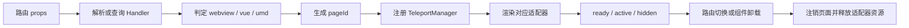

# 动态页面容器说明

本文档对应 `githubDashboard` 分支当前实现，说明 Dashboard 如何统一承载 WebView、远程 Vue SFC 和 UMD 组件。

## 支持范围

| 类型 | 识别方式 | 渲染器 | 主要用途 |
| --- | --- | --- | --- |
| `webview` | 普通 URL 或默认类型 | `webview.vue` | iframe 页面、存量系统 |
| `vue` | Handler 以 `.vue` 结尾，或路由显式指定 | `vueComponent.vue` | 运行时加载 Vue SFC |
| `umd` | Handler 使用 `<ComponentName ...>` 标签形式 | `umd-component/index.vue` | 渲染已注册的 UMD 组件 |

当前分支没有独立的 ExtJS 渲染器。`#extjs-root` 是历史沿用的挂载点名称，现用于 WebView 和远程 Vue 组件的 Teleport 容器；ExtJS 应通过 WebView/Bridge 作为外部系统接入。

## 核心文件

- 页面入口：[iframe-page/index.vue](../src/views/_builtin/iframe-page/index.vue)
- WebView 渲染器：[iframe-page/webview.vue](../src/views/_builtin/iframe-page/webview.vue)
- 远程 Vue 渲染器：[iframe-page/vueComponent.vue](../src/views/_builtin/iframe-page/vueComponent.vue)
- UMD 页面适配器：[umd-component/index.vue](../src/views/_builtin/umd-component/index.vue)
- 页面与组件缓存：[teleport-manager.ts](../src/store/modules/teleport-manager.ts)
- Teleport 挂载点：[global-content/index.vue](../src/layouts/modules/global-content/index.vue)
- UMD 加载入口：[remoteComponentLoader.ts](../src/utils/remoteComponentLoader.ts)

## 输入与类型判定

IframePage 接收以下主要 props：

```ts
{
  url: string
  kvid?: string
  functionKvid?: string
  handler?: string
  type?: 'webview' | 'vue' | 'umd'
  routeQuery?: Record<string, string>
  backendOrigin?: string
}
```

初始化时优先使用路由层传入的 `handler`。如果未提供且存在 `kvid`，入口会请求：

```text
/Restful/Kivii.Basic.Entities.Function/Access.json?MenuKvids={kvid}
```

Handler 的判定规则如下：

1. 以 `.vue` 结尾：远程 Vue SFC。
2. 以 `<` 开头且包含 `>`：UMD 组件标签。
3. 其他值：WebView URL。

绝对 HTTP(S) Handler 会直接使用；相对 Handler 当前会拼接 `https://datav.kivii.org`。这是现有兼容行为，不应把该默认地址视为可移植配置。

组件 props 或路由参数变化时，入口会让旧请求失效，重新解析 Handler、注销旧页面实例并注册新实例，避免较慢的旧请求覆盖新页面状态。

## 页面生命周期



`generatePageId()` 使用类型、URL、Kvid、时间戳和随机值生成页面实例 ID。TeleportManager 保存实例状态，并通过激活队列保证同一时刻只有一个动态页面处于活动状态：

- `pending`：入口已注册。
- `loading`：适配器开始加载。
- `ready`：资源已加载完成。
- `active`：当前应显示。
- `hidden`：保留实例但隐藏。

标签重新激活时，IframePage 使用 `forceActivate()` 立即切换活动实例。切换到普通页面时，路由层可以调用 `hideAllPages()` 隐藏 Teleport 页面。

## WebView 渲染

WebView 会把 `routeQuery` 通过 `URLSearchParams` 追加到 URL，并只接受 HTTP(S) 地址或以 `/` 开头的站内路径。

首次渲染延迟 300 ms，以等待布局和 Teleport 挂载点就绪。首次创建使用 `v-if`，后续标签切换使用 `v-show`，从而保留 iframe 内部状态。卸载时会：

1. 清除延迟定时器。
2. 将 iframe 地址切换为 `about:blank`。
3. 释放本地显示状态并发出 `cleanup`。

浏览器的 CSP、`X-Frame-Options`、Cookie SameSite 和跨域策略仍由被嵌入系统决定，宿主无法绕过这些限制。

## 远程 Vue SFC

远程 Vue 通过 `vue3-sfc-loader` 加载。HTTP(S) URL 会取出 pathname，再由 `@kivii.com/bridge` 的请求封装获取源码，因此部署环境需要提供相应的同源代理或后端路径。

缓存键由完整组件 URL、`backendOrigin` 和 `kvid` 组成。TeleportManager 同时维护：

- 已完成的组件与动态插入样式缓存。
- 正在进行的加载 Promise，避免并发重复请求。
- 缓存 generation，防止清理后的旧异步任务重新写回缓存。

普通页面卸载不会立即删除共享 SFC 缓存；用户会话重置时，`clearUserRuntime()` 会清除页面状态、组件缓存、加载任务和对应的动态样式。

## UMD 组件

UMD 脚本由应用启动阶段的远程组件加载器注册到 Vue App。IframePage 只负责把类似下面的 Handler 转换成组件名和 props：

```html
<CustomerPanel :page-size="20" mode="compact" />
```

UMD 页面适配器支持字符串、数字、布尔值、`null`、`undefined`、对象和数组等绑定值。最终 props 的覆盖顺序为：

1. Handler 标签属性。
2. 当前路由 query。
3. 入口透传 attrs。

组件注册表不是响应式对象，因此加载器通过注册版本信号通知页面重新检查。只有所有 UMD 加载任务结束后仍未注册，页面才显示“组件未注册”；加载期间显示等待状态。

UMD 脚本属于可信运行时代码，会在宿主页面上下文中执行。生产环境必须限制来源、使用 HTTPS，并对制品进行版本、完整性和发布权限控制。

## 动态路由配合

后端菜单生成的页面路由统一使用 `view.iframe-page`，并传入：

```ts
props: {
  url,
  kvid,
  functionKvid,
  handler,
  type
}
```

静态详情入口位于 [auto/routes.ts](../src/router/auto/routes.ts)，路径为 `/iframe-page/detail/:url(.*)`。完整的动态菜单生成规则参见 [动态菜单与路由说明](./dynamic-routes-module.md)。

## 自定义路由参数

当路径以 `/custom_` 或 `/bridge_` 开头且渲染类型为 `vue` 时，IframePage 会把 `routeQuery` 写入：

```ts
window.customRouteParamsManager[route.fullPath]
```

页面清理时会删除对应记录。当前开源分支只保留这一兼容协议，不包含创建自定义/桥接路由的独立管理器文件；集成方需自行提供路由来源。

## 运维与排查

- 页面一直显示加载中：检查 Handler 查询是否返回，以及旧请求是否因路由变化被取消采用。
- WebView 空白：检查 URL 格式、浏览器控制台及目标站点 iframe 策略。
- Vue SFC 加载失败：检查代理路径、源码响应类型和 `backendOrigin`。
- UMD 显示未注册：检查远程库状态、导出组件名和 Manifest。
- 标签切换残留：检查页面是否正确注销，以及退出登录是否调用 `clearUserRuntime()`。

## 当前限制

- 相对 Handler 的默认服务地址仍为硬编码兼容值。
- 远程 Vue 源码必须可通过宿主请求链路读取。
- UMD 组件共享宿主 Vue Runtime 和全局注册表，不具备安全沙箱隔离。
- `#extjs-root` 名称与当前职责不一致，但修改会影响既有布局和组件协议，需作为独立兼容性任务处理。
