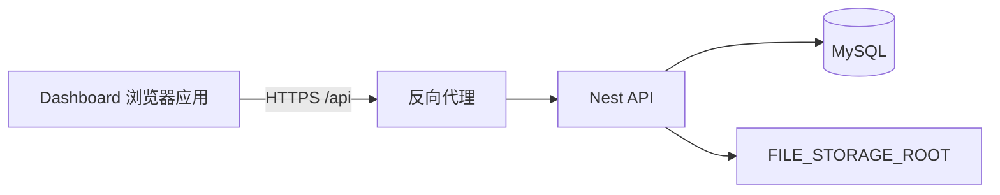

# 自建 API 接入

`Dashboard-lightWeight-Api` 使用 Nest API、MySQL 和服务端本地文件目录。浏览器只访问同站点的 `/api`，不直接连接数据库或文件目录。



## 一键演示

当前分支将 Nest API 放在 `server/`，根目录的 `docker-compose.demo.yml` 编排四个服务：

- `mysql`：MySQL 8.4 和持久化数据卷；
- `api`：执行 TypeORM 迁移后启动 Nest；
- `seed`：创建或确认演示账号并授予超级管理员角色；
- `dashboard`：构建 Vue 应用，通过 Nginx 提供静态资源并代理 `/api`。

```bash
docker compose -f docker-compose.demo.yml up --build
```

`pnpm demo` 是同一命令的快捷方式。

打开 `http://localhost:8080`，使用 `admin@example.com` / `admin@123456` 登录。该配置用于本机演示；公开部署必须替换默认账号和数据库密码，并使用 HTTPS。

## 前端配置

复制环境变量示例并启动前端：

```bash
cp .env.example .env
pnpm install
pnpm dev
```

```dotenv
VITE_API_BASE_URL=/api
```

开发服务器监听 `127.0.0.1:5173`，把 `/api` 代理到 `http://127.0.0.1:3000`，并移除转发路径中的 `/api` 前缀。生产环境应提供同样的同源代理；刷新令牌 Cookie 的路径需要从 `/auth` 改写为 `/api/auth`。

## 响应和认证

JSON 接口使用统一响应格式：

```json
{
  "status": 200,
  "message": "success",
  "Results": {},
  "Total": 1
}
```

登录成功后，访问令牌只保存在应用内存中，通过 `Authorization: Bearer <accessToken>` 调用受保护接口。刷新令牌由 `HttpOnly` Cookie 保存。页面重新打开、访问令牌临近过期或接口返回 `401` 时，前端调用 `POST /auth/refresh`，更新访问令牌并重试原请求。所有请求使用 `credentials: 'include'`。

生产环境必须使用 HTTPS，并配置实际的 `FRONTEND_ORIGIN`。刷新 Cookie 使用 `SameSite=Strict`，因此前端与 API 应部署在同一站点。

## 认证与用户接口

| 方法 | 路径 | 说明 |
| --- | --- | --- |
| `POST` | `/users` | 注册用户，提交 `name`、`email`、`password` |
| `POST` | `/auth/login` | 登录并返回访问令牌 |
| `POST` | `/auth/refresh` | 轮换刷新 Cookie 并返回新访问令牌 |
| `GET` | `/auth/me` | 获取当前用户 |
| `POST` | `/auth/change-password` | 修改密码并撤销全部已有会话 |
| `POST` | `/auth/logout` | 撤销当前刷新会话 |
| `GET` | `/users` | 普通用户只查看本人，超级管理员查看全部 |
| `GET` | `/users/:id` | 本人或超级管理员查看 |

密码为 8–128 位，必须同时包含字母、数字和符号，不能包含空格。同一邮箱在 15 分钟内连续失败 10 次后锁定 15 分钟。数据库只保存带随机盐的密码哈希。

## Dashboard 接口

| 方法 | 路径 | 说明 |
| --- | --- | --- |
| `GET` | `/dashboard-functions` | 查询功能列表 |
| `POST` | `/dashboard-functions` | 新增或按 `kvid` 更新功能 |
| `PATCH` | `/dashboard-functions/:kvid` | 更新功能字段 |
| `DELETE` | `/dashboard-functions/:kvid` | 删除功能 |
| `POST` | `/dashboard-functions/import` | 批量导入功能 |
| `GET` | `/dashboard-admin/me/roles` | 当前用户角色 |
| `GET` | `/dashboard-admin/menus/runtime?internalCode=...` | 当前用户可见菜单 |
| `GET` | `/dashboard-admin/menus/autostart?menuRootKvid=...` | 自动启动菜单 |
| `GET` | `/dashboard-admin/admin/menu-config` | 管理端菜单、菜单根和功能配置 |
| `GET` | `/dashboard-admin/admin/permissions` | 管理端用户、角色和权限配置 |

带 `/dashboard-admin/admin/` 的接口和功能写接口要求超级管理员。普通用户只能读取自己的角色以及经过权限过滤的运行时菜单。

## 文件存储接口

| 方法 | 路径 | 说明 |
| --- | --- | --- |
| `POST` | `/files` | `multipart/form-data` 上传，字段名为 `file` |
| `GET` | `/files` | 普通用户查看本人文件，超级管理员查看全部 |
| `GET` | `/files/:id/download` | 本人或超级管理员下载 |
| `DELETE` | `/files/:id` | 本人或超级管理员删除 |

文件内容写入 `FILE_STORAGE_ROOT`，元数据写入 MySQL 的 `stored_files`。默认单文件上限为 50 MB，每位用户总量上限为 1 GB；生产环境应使用持久卷并纳入备份。

## UMD 导入和版本

UMD Runtime Lab 使用 `multipart/form-data` 调用 `POST /dashboard-functions/import-umd`，字段包括：

- `file`：原始 `.js` 文件；
- `manifest`：Manifest JSON 字符串；
- `components`：组件清单 JSON 字符串；
- `moduleKey`：组件库稳定标识；
- `name`：显示名称；
- `version`：版本号。

| 方法 | 路径 | 说明 |
| --- | --- | --- |
| `GET` | `/dashboard-functions/umd-versions?moduleKey=...` | 查询版本记录 |
| `PUT` | `/dashboard-functions/umd-versions/:id/activate` | 启用指定历史版本 |
| `GET` | `/dashboard-assets/:versionId/:fileName` | 加载不可变 UMD 文件 |

启用版本后，服务端更新同一 `source_module` 下功能记录的 `source_url`。运行时菜单返回该地址，PageHost 在用户打开菜单时加载对应脚本。

## 生产代理示例

下面只展示关键路径，域名和上游地址按部署环境调整：

```nginx
location /api/ {
  proxy_pass http://127.0.0.1:3000/;
  proxy_set_header Host $host;
  proxy_set_header X-Forwarded-Proto $scheme;
  proxy_cookie_path /auth /api/auth;
}

location / {
  try_files $uri $uri/ /index.html;
}
```

部署前在后端运行 TypeORM 迁移，并配置 MySQL、`FRONTEND_ORIGIN`、JWT 密钥、HTTPS 证书和 `FILE_STORAGE_ROOT`。
